## 💻 Instrucciones para Ejecutar la Aplicación Localmente

Sigue estos pasos para levantar el servidor (*backend*) y la aplicación de React (*frontend*).

### 1. Prerrequisitos

Asegúrate de tener instalado:

* **Node.js** (versión LTS recomendada)
* **npm** (viene con Node.js)
* **Git**

### 2. Clonar el Repositorio
Clona el repositorio en tu máquina local.

3. Configuración del Backend (Servidor Express)
El servidor de la API se ejecutará en el puerto 3000.

Navega a la carpeta del backend:

`cd backend`

Instala las dependencias:
`npm install`
Crea el archivo de variables de entorno: Crea un archivo llamado .env en la carpeta backend con el siguiente contenido:

`PORT=3000`
`URL=localhost`

Inicia el servidor:
`npm run dev`
El servidor estará corriendo en http://localhost:3000.

4. Configuración del Frontend (Aplicación React)
La aplicación de React se ejecutará en el puerto por defecto de Vite, que es el 5173.

Navega a la carpeta del frontend:
`cd ../frontend`
Instala las dependencias:
`npm install`
Crea el archivo de variables de entorno: Crea un archivo llamado .env en la carpeta frontend con la URL base del backend:

`VITE_API_URL=http://localhost:3000`
Inicia la aplicación de React:
`npm run dev`
La aplicación estará disponible en http://localhost:5173.

## Capturas del funcionamiento de la aplicación.
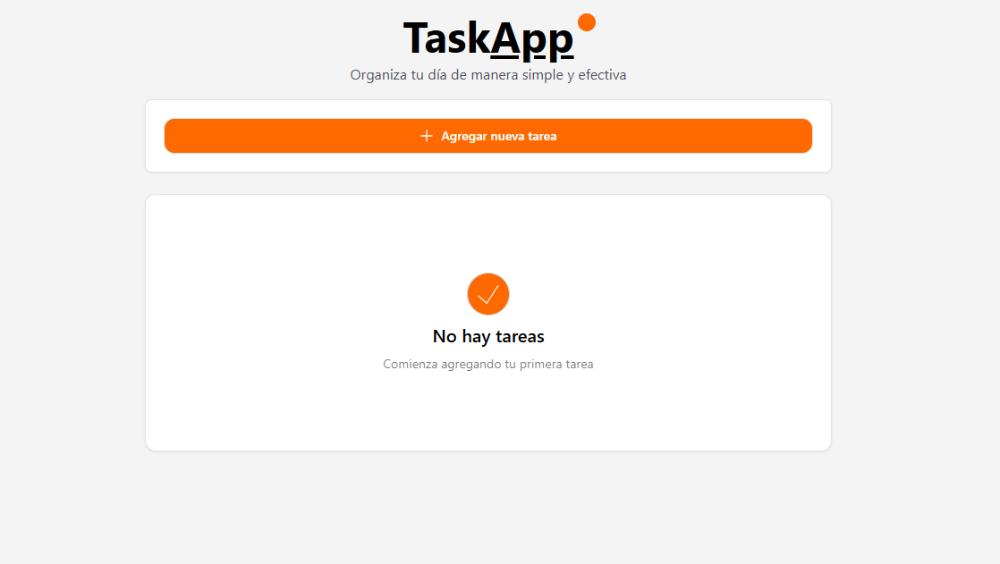
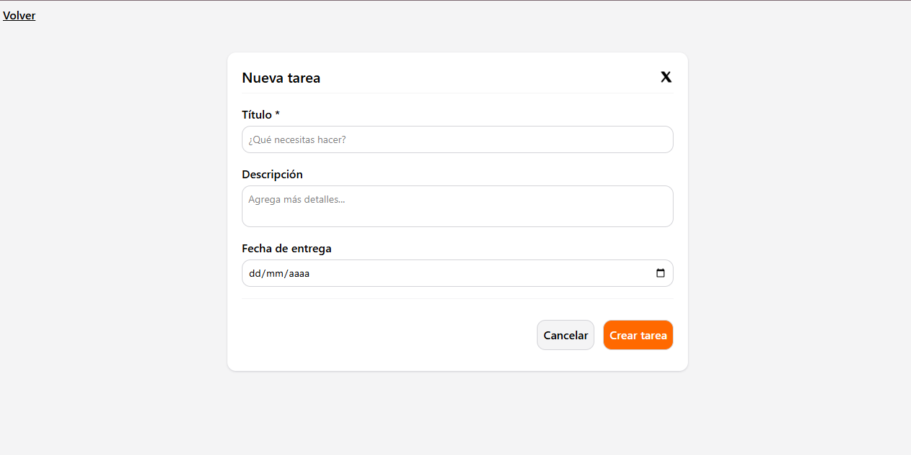
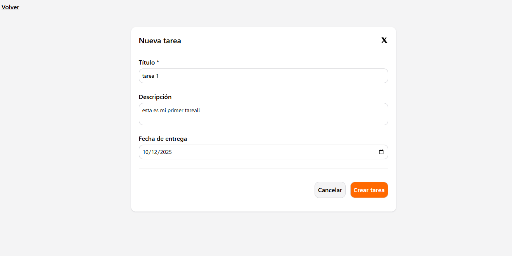
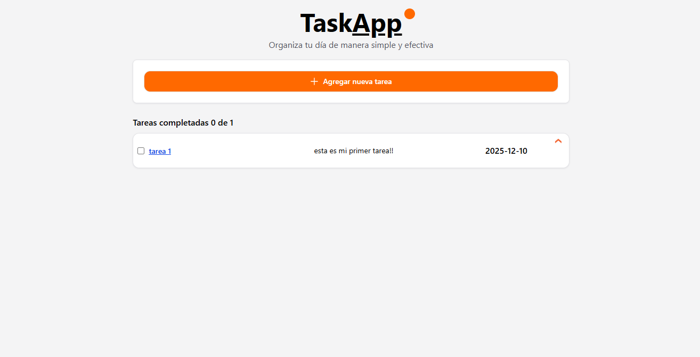
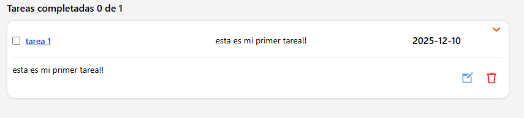
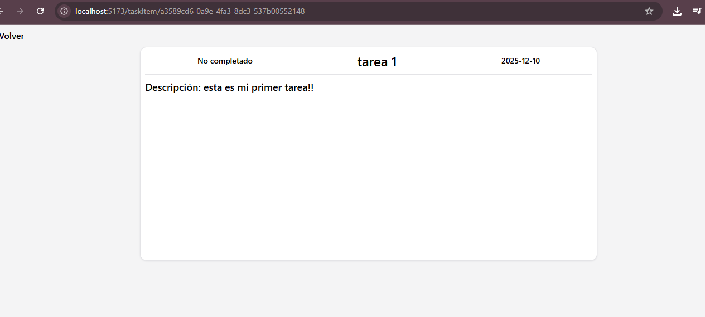
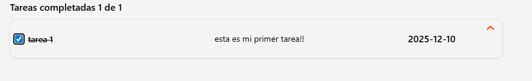
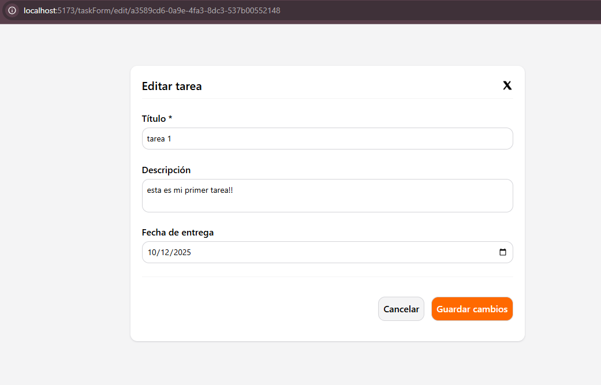
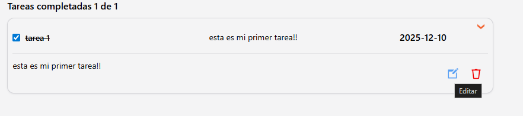
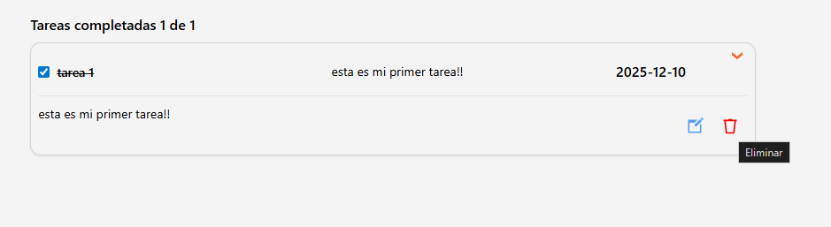
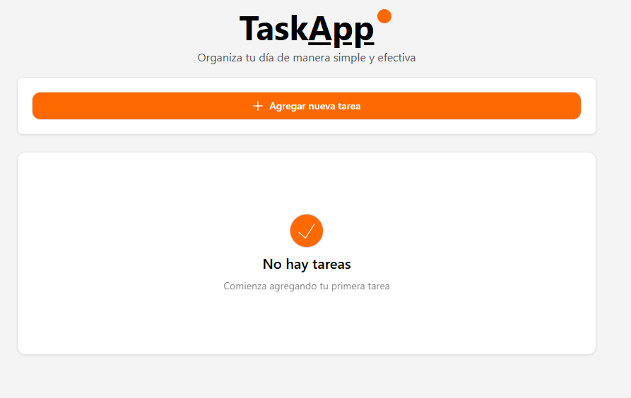
